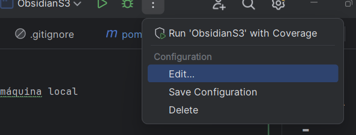

# JAR-Obsidian

1. Faça o o git clone do repositório para a sua máquina local;

2. Abra o projeto no Intellij;

3. No arquivo pom.xlm instale vá no menu Maven na lateral direita para instala-lo;
  


4. Na parte superior clique nos 3 pontinhos e selecione a opção "Editar"



5. Ao lado do campo Environment variables, clique no ícone de três pontos (...) ou no botão de lápis (dependendo da versão do IntelliJ) para abrir a janela onde para adicionar ou modificar as variáveis de ambiente.


6. No nosso caso vamos usar os nomes: 

```java
AWS_ACCESS_KEY_ID
AWS_SECRET_ACCESS_KEY
AWS_SESSION_TOKEN
```


7. No ambiente de lab, clique na aba AWS Details e depois em show;


8. Adicione os tokens na variável de ambiente correspondente;


9. Rode o projeto na classe ObsidianMain


10. Resultado no terminal 


11. Confira se o arquivo foi baixado do S3


